**Лабораторная работа № 2**  
**по дисциплине “Администрирование информационных систем”**

Факультет: ПМИ  
Группа: ПМИ-23  
Студент: Болотин Д.В.  
Бригада: 13  
Преподаватели: Аврунев Олег Евгеньевич 

# Цели

Ознакомиться с принципами организации логической структуры и физического хранения объектов базы данных PostgreSQL.

# Ход работы

## 1.Для базы данных demo получить:
- a. Список схем  
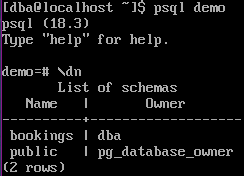
- b. Список таблиц в схеме bookings  
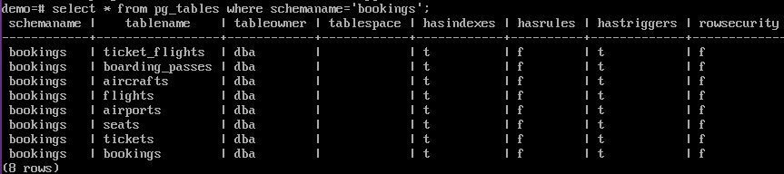
- c. Список индексов в схеме bookings  
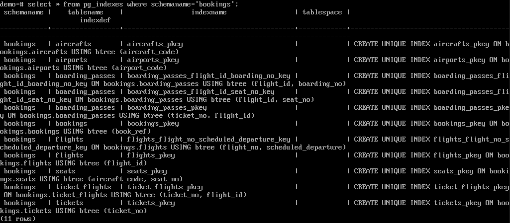

## 2. Для выбранной таблицы из схемы bookings получить расположение соответствующего файла данных, размер таблицы в страницах, размер соответствующего файла данных (средствами ОС).

**Вариант задания**  
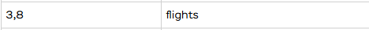

- Расположение файла данных(относительный путь) и количество страниц
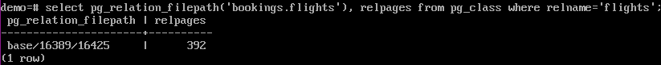
    - Расположение файла: base/16389/16425
    - Количество страниц: 392

- Размер соответствующего файла данных
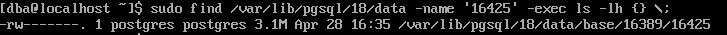
    - Размер файла: 3.1Mb

## 3. Сравнить размер файла и объем таблиц в страницах. Размер одной страницы равен 8 КБ.
Размер таблицы в Mb: 392 * 8 / 1024 = 3.0625Mb  
Размер файла: 3.1Mb  
  
Размер таблицы в страницах: 392  
Размер файла в страницах: 3.1 * 1024 / 8 = 396.8

## 4. Создать табличное пространство в каталоге, созданном в домашнем каталоге пользователя dba.  
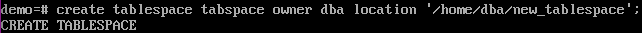  

## 5. Создать отдельную схему.
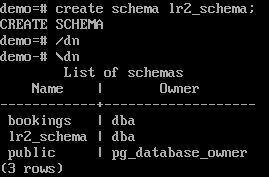

## 6. В новой схеме сделать копию выбранной таблицы, указав в качестве хранения созданное табличное пространство. Заполнить её данными из исходной.

**Вариант задания**  
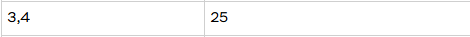  

- Создание таблицы  
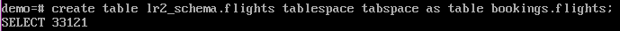  
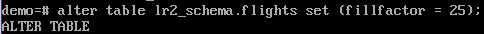  

- Проверка  
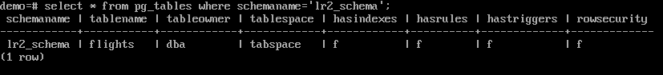  

## 7. Получить для созданной таблицы данные о занятом пространстве и расположении её файлов.  
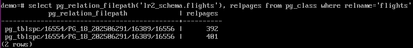
- Количество прозвращаемых страниц незначительно больше, чем для исходной таблицы, проанализируем таблицу  
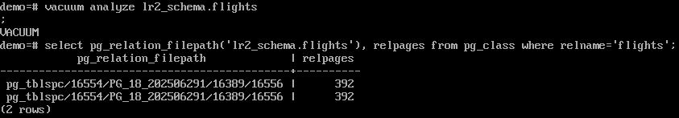  Теперь количество равно исходному.

## 8. Отключить автоматическую очистку.  
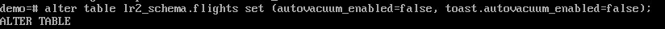

## 9. Удалить все данные из таблицы, подтвердить транзакцию и повторно выполнить пункт 7.
- Удаление данных  
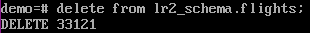 

- Повторное выполнение п.7  
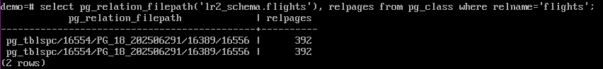

Расположение и размер не изменились.

## 10. Выполнить сборку мусора для таблицы (vacuum). Повторить пункт 7.

- Сборка мусора  
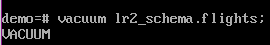  

- Повтороное выолнение п.7  
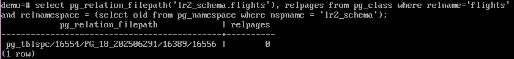

Расположение не поменялось, размер файла стал равен 0.