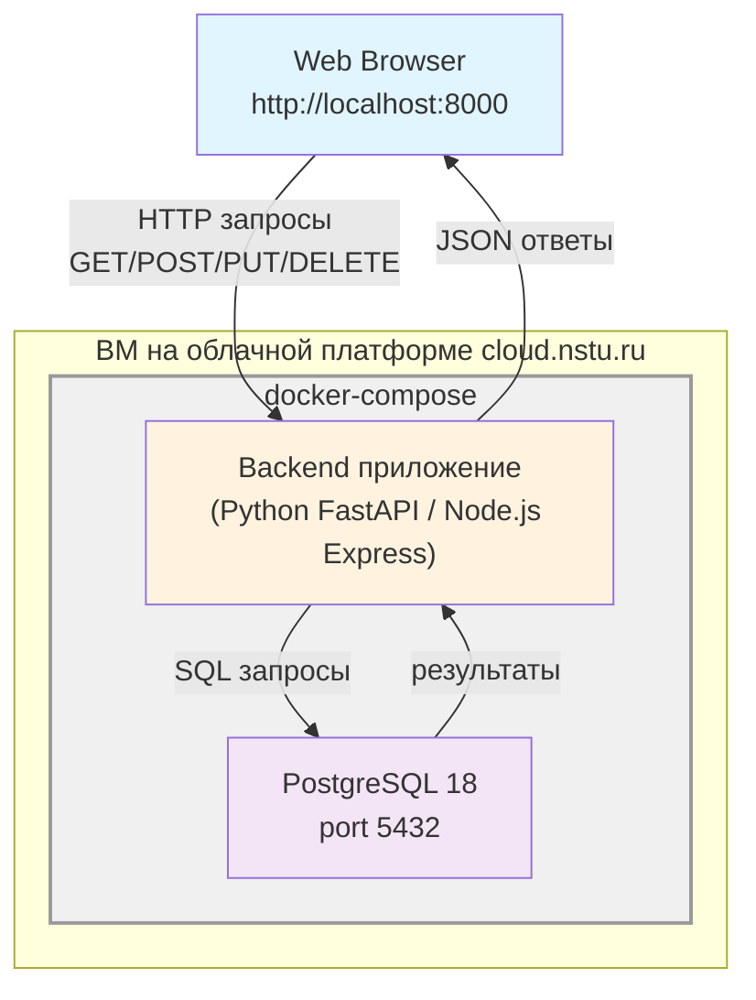

```mermaid
graph TB
    Client["Web Browser<br/>http://localhost:8000"]
    
    subgraph VM["ВМ на облачной платформе cloud.nstu.ru"]
        subgraph Compose[" docker-compose"]
            Backend[" Backend приложение<br/>(Python FastAPI / Node.js Express)"]
            Postgres[" PostgreSQL 18<br/>port 5432"]
        end
    end
    
    Client -->|HTTP запросы<br/>GET/POST/PUT/DELETE| Backend
    Backend -->|SQL запросы| Postgres
    Postgres -->|результаты| Backend
    Backend -->|JSON ответы| Client
    
    style Client fill:#e1f5ff
    style Backend fill:#fff3e0
    style Postgres fill:#f3e5f5
    style Compose fill:#f0f0f0,stroke:#999,stroke-width:2px
```